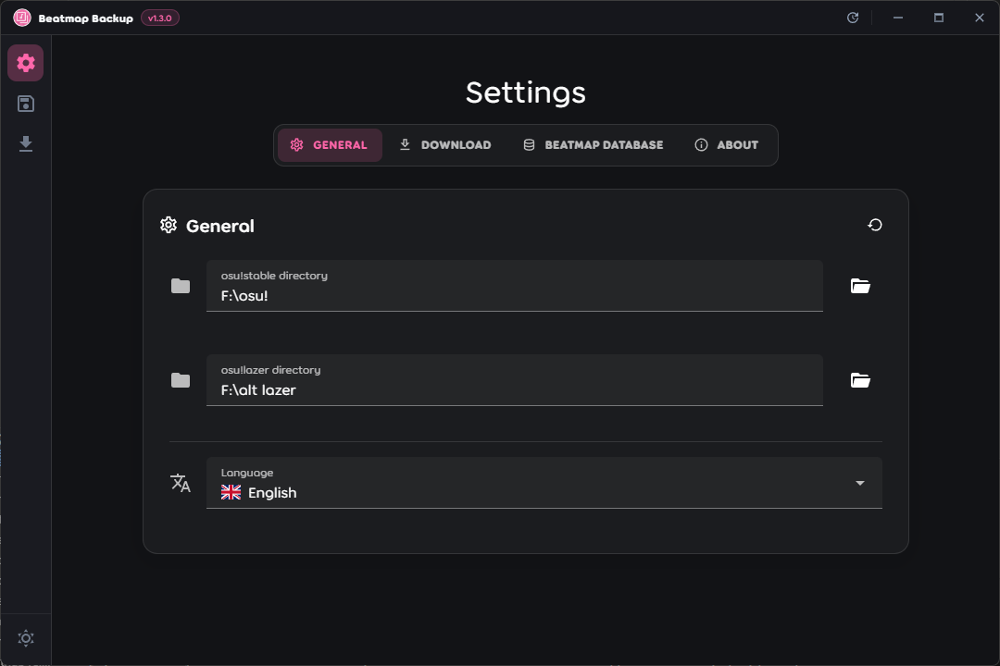
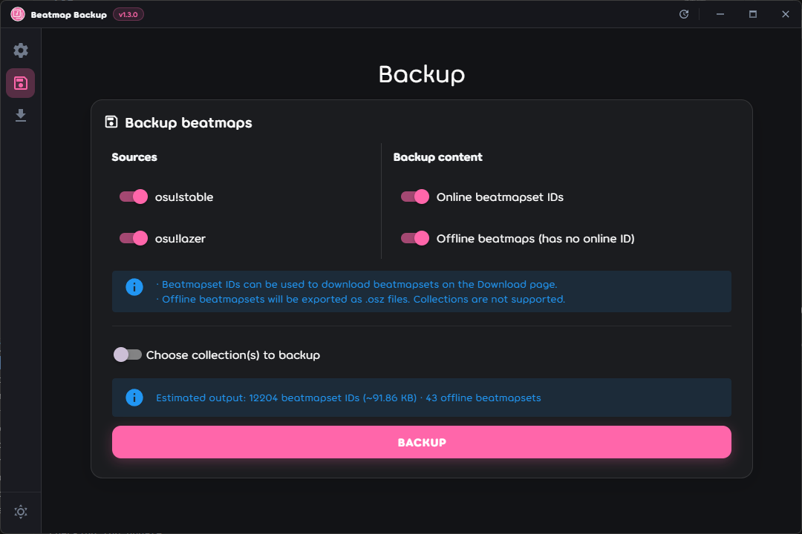
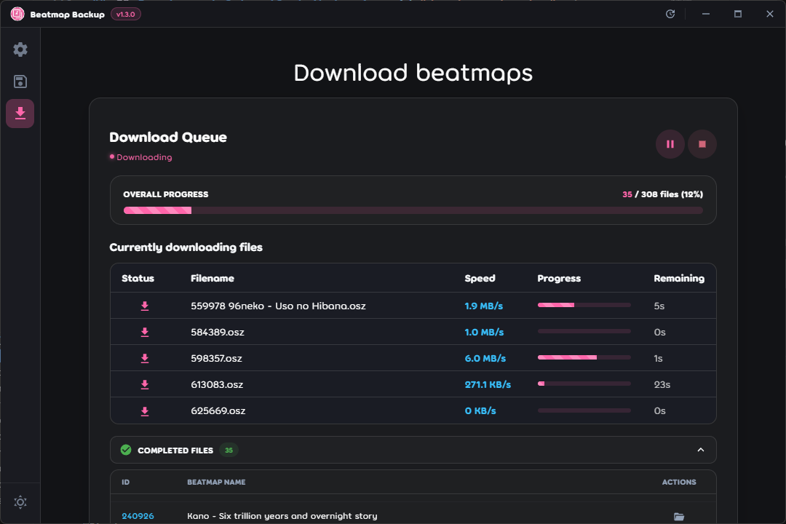
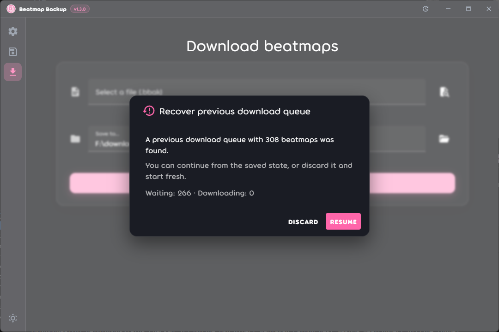

<h1 align="center">
<a href="https://github.com/vndarkblue/beatmap-backup">

</a>

Beatmap Backup

</h1>

<div align="center">

[](https://github.com/vndarkblue/beatmap-backup/releases/latest)
[](https://github.com/vndarkblue/beatmap-backup/actions/workflows/ci.yml)
[](#quick-start)
[](LICENSE)

[](https://github.com/electron/electron)
[](https://github.com/microsoft/TypeScript)
[](https://github.com/vuejs/)
[](https://github.com/vuetifyjs/vuetify)

<p align="center">
  <a href="README.md">English</a> •
  <a href="README.vi.md">Tiếng Việt</a> •
  <b>日本語</b>
</p>

<p align="center">
  <a href="#quick-start"><b>インストール</b></a> •
  <a href="#screenshots">スクリーンショット</a> •
  <a href="#development-setup">開発環境のセットアップ</a> •
  <a href="#contributing">貢献</a>
</p>

</div>

## ℹ️ 概要 <a id="about"></a>

osu! プレイヤー向けの譜面コレクションのバックアップ・共有デスクトップアプリです。何百ギガバイトもの譜面フォルダーを丸ごとコピーする代わりに、Beatmap Backup は譜面セット ID のリスト（通常わずか数百キロバイト）を保存し、復元時にパブリックミラーから自動的に再ダウンロードします。

主な用途:

- Windows の再インストール、新しい PC への移行、またはドライブ障害からの復旧
- 1つの小さなファイルで友達にコレクションを共有

## 🚀 クイックスタート（一般ユーザー向け） <a id="quick-start"></a>

1. **ダウンロード:** [Releases](https://github.com/vndarkblue/beatmap-backup/releases/latest) から最新バージョンを入手します（Windows はインストーラー `.exe` またはポータブル版 `.zip`、Linux は `.AppImage` または `.deb`）。
2. **起動:** インストールしたアプリを実行します（ポータブル版の場合は展開して実行ファイルを起動）。
3. **osu! フォルダーの確認:** **Settings**（設定）で osu! フォルダーが正しく検出されているか確認します。
4. **ライブラリの同期:** osu! が終了していることを確認し、ライブラリ同期を実行して譜面をインデックスします。

## 動作環境 <a id="requirements"></a>

- Windows 10/11 または Linux
- osu!stable および/または osu!lazer がインストールされていること
- **アプリが譜面ライブラリを読み取る際は、必ず osu! を終了してください。** osu!stable は実行中に `osu!.db` をロックし、osu!lazer はプレイ中に `client.realm` へ継続的に書き込みを行うため、不整合なデータが読み取られる可能性があります。アプリはクライアントの起動を検出すると同期をスキップして不正なデータの読み取りを防ぎます。なお、ダウンロード機能への影響はありません（osu! を起動したまま復元・ダウンロード可能です）。

---

## ✨ 機能 <a id="features"></a>

- **バックアップ** — 譜面ライブラリを軽量な `.bbak` ファイルにエクスポート
  - **両クライアント対応** — osu!stable (`osu!.db`) および osu!lazer (`client.realm`) を読み取り
  - **コレクションフィルター** — 特定のコレクションのみを対象にバックアップ
  - **ローカル譜面** — オンライン ID のない未登録/自作譜面を `.osz` ファイルとして直接エクスポート
- **復元＆ダウンロード** — パブリックミラーから譜面を直接再ダウンロード
  - **スマートミラーフェイルオーバー** — レート制限を回避するため複数のミラー間で自動ローテーションおよびフェイルオーバー
  - **キュー管理** — セッションをまたいだ一時停止・再開、失敗した譜面の再試行
  - **重複検出** — すでに stable や lazer にインストールされている譜面をスキップ

## ❓ 仕組み <a id="how-it-works"></a>

バックアップファイルはプレーンテキスト形式（`.bbak`）です。先頭の数行のコメントと、1行に1つの譜面セット ID が記述されています。メモ帳などのテキストエディタで確認・編集できます。

```
# Beatmap Backup File
# Format: One beatmapset ID per line
# Created: 2026-08-28T09:00:00.000Z
# Total beatmaps: 4213
# Source: Stable + Lazer

12345
67890
```

復元時はそのリストを読み取り、各譜面セットを `.osz` ファイルとして指定したフォルダーにダウンロードします。**Beatmap Backup は osu! への自動インポートは行いません** — ダウンロード後、ファイルをゲーム画面へドラッグ＆ドロップするか、ダブルクリックしてインポートしてください。

## 🖼️ スクリーンショット <a id="screenshots"></a>

### Settings



### Backup



### Download



### Resume Download



## 🛠️ 開発環境のセットアップ（コントリビューター向け） <a id="development-setup"></a>

### 前提条件

- [Node.js](https://nodejs.org/) (v20 以上)
- [npm](https://www.npmjs.com/) (v10 以上)
- [osu!](https://osu.ppy.sh/) がインストールされていること (stable および/または lazer)

インストール時にネイティブモジュール (`better-sqlite3`, `realm`) が Electron 向けにリビルドされるため、C++ ビルドツールチェーンが必要です（Windows の場合は Visual Studio Build Tools、Linux の場合は `build-essential` と `python3`）。

### ソースコードからのビルド（クローン＆ローカル実行）

1. リポジトリをクローンします:

```bash
git clone https://github.com/vndarkblue/beatmap-backup.git
cd beatmap-backup
npm install
npm run dev
```

### 利用可能なスクリプト

```bash
npm run dev          # 開発サーバーを起動
npm run build        # 型チェック後、本番用にビルド
npm run build:win    # Windows 向けビルド
npm run build:linux  # Linux 向けビルド
npm test             # Vitest テストスイートを実行
npm run lint         # ESLint を実行
npm run typecheck    # main、preload、renderer の型チェック
```

### プロジェクト構成

```
beatmap-backup/
├── src/
│   ├── main/                # Electron メインプロセス、ウィンドウライフサイクル、IPC ルーティング
│   ├── preload/             # コンテキストブリッジと公開 API
│   ├── renderer/            # Vue 3 アプリケーション
│   │   └── src/
│   │       ├── assets/      # グローバル CSS と静的アセット
│   │       ├── components/  # Vue コンポーネント (Settings, Backup, Download, layout)
│   │       ├── composables/ # 再利用可能な Vue コンポーザブル
│   │       ├── i18n/        # 翻訳ファイル
│   │       └── router/      # Vue Router 設定
│   ├── services/            # アプリケーションロジック (メインプロセス)
│   │   ├── collection/      # collection.db および lazer コレクション読み取り
│   │   ├── database/        # SQLite スキーマ、インポーター、同期マネージャー
│   │   └── download/        # ダウンロードキュー内部処理、ミラー＆スケジューラー
│   ├── config/              # 共有定数、ミラー定義
│   └── utils/               # 共有ヘルパー関数
└── tests/                   # Vitest テストスイート
```

## 🤝 貢献 <a id="contributing"></a>

コントリビューションは大歓迎です！

詳細なガイドラインについては [`CONTRIBUTING.md`](CONTRIBUTING.md) を参照してください。

## 🙏 クレジット

本アプリは公開されている beatmap ミラー API を利用しています。各プロジェクトおよびメンテナの皆様に感謝いたします:

- [osu.direct](https://osu.direct/)
- [NeriNyan](https://nerinyan.moe/)
- [Mino (旧 chimu.moe)](https://catboy.best/)
- [Nekoha](https://mirror.nekoha.moe/)
- [BeatConnect](https://beatconnect.io/)

ミラーサーバーへの負荷を軽減するため、ダウンロード動作はデフォルトで控えめに設計されています:

- 使用前にミラーの稼働状態をヘルスチェック
- 単一のエンドポイントに集中せず、複数のミラーにリクエストを分散
- 応答が遅いまたは一時的に停止しているミラーから自動的にフォールバック
- 同じタスクに対する不要な API 呼び出しの重複を防止

上記ミラーを運営されている方で、万が一問題のあるトラフィックパターンにお気づきの場合は、速やかに対応いたしますので issue を作成してください。

## ❗ 免責事項

本アプリは非公式のツールであり、osu! または ppy Pty Ltd との提携、承認、後援関係はありません。

## 📄 ライセンス

本プロジェクトは MIT ライセンスの下で提供されています — 詳細は [LICENSE](LICENSE) をご覧ください。
