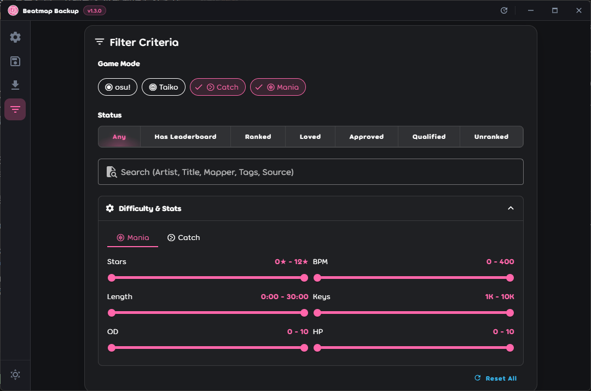
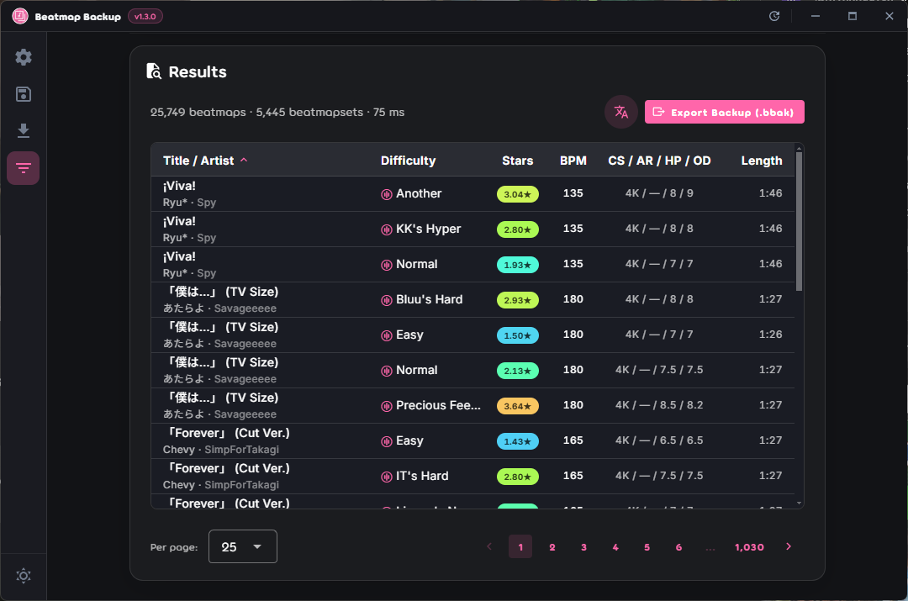

<h1 align="center">
<a href="https://github.com/vndarkblue/beatmap-backup">

</a>

Beatmap Backup

</h1>

<div align="center">

[](https://github.com/vndarkblue/beatmap-backup/releases/latest)
[](https://github.com/vndarkblue/beatmap-backup/actions/workflows/ci.yml)
[](#quick-start)
[](LICENSE)

[](https://github.com/electron/electron)
[](https://github.com/microsoft/TypeScript)
[](https://github.com/vuejs/)
[](https://github.com/vuetifyjs/vuetify)

<p align="center">
  <b>English</b> •
  <a href="README.vi.md">Tiếng Việt</a> •
  <a href="README.ja.md">日本語</a>
</p>

<p align="center">
  <a href="#quick-start"><b>Install</b></a> •
  <a href="#screenshots">Screenshots</a> •
  <a href="#development-setup">Development Setup</a> •
  <a href="#contributing">Contributing</a>
</p>

</div>

## ℹ️ About <a id="about"></a>

A desktop app for osu! players to back up and share their beatmap collection. Instead of copying hundreds of gigabytes of beatmap files, Beatmap Backup saves a list of your beatmapset IDs — usually a few hundred kilobytes — and re-downloads the beatmaps from public mirrors when you restore.

Typical uses:

- Reinstalling Windows, moving to a new machine, or recovering from a dead drive
- Sending your collection to a friend as one small file

## 🚀 Quick Start (For Users) <a id="quick-start"></a>

1. **Download:** Head over to [Releases](https://github.com/vndarkblue/beatmap-backup/releases/latest) and grab the latest version (Installer `.exe` or Portable `.zip` for Windows, `.AppImage` or `.deb` for Linux).
2. **Launch:** Run the installed app (or extract and run the portable executable).
3. **Verify osu! Path:** In **Settings**, check that your osu! folder was detected correctly.
4. **Sync Library:** Ensure osu! is closed, then run a library sync to index your beatmaps.

## Requirements <a id="requirements"></a>

- Windows 10/11 or Linux
- osu!stable and/or osu!lazer installed
- **osu! must be closed when the app reads your beatmap library.** osu!stable locks `osu!.db` while running, and osu!lazer writes to `client.realm` continuously during play, which would produce an inconsistent snapshot. The app detects a running client and skips the sync instead of reading bad data. Downloading is unaffected - you can restore while osu! is open.

---

## ✨ Features <a id="features"></a>

- **Filter & Search** — Explore and query your beatmap library with rich criteria
  - **Multi-criteria filter** — Filter by game mode, ranked status, star rating, BPM, song length, and stats
  - **Filtered export** — Export filtered results directly into a `.bbak` file for targeted sharing
- **Backup** — Export your beatmap library into a compact `.bbak` file
  - **Both clients** — Reads osu!stable (`osu!.db`) and osu!lazer (`client.realm`)
  - **Collection filter** — Narrow backups down to specific collections
  - **Local beatmaps** — Export unranked/local beatmaps without online IDs as `.osz` files
- **Restore & Download** — Re-download beatmaps directly from public mirrors
  - **Smart mirror fallback** — Auto-rotation and failover across mirrors to avoid rate limits
  - **Queue management** — Pause, resume across sessions, and retry failed downloads
  - **Duplicate detection** — Skip beatmaps already present in your stable or lazer library

## ❓How it works <a id="how-it-works"></a>

A backup file is a plain text file (`.bbak`): one beatmapset ID per line, with a few comment lines at the top. You can open it in any text editor.

```
# Beatmap Backup File
# Format: One beatmapset ID per line
# Created: 2026-08-28T09:00:00.000Z
# Total beatmaps: 4213
# Source: Stable + Lazer

12345
67890
```

Restoring reads that list and downloads each beatmapset as an `.osz` file into a folder you choose. **Beatmap Backup does not import the files into osu! for you** - you drag them into the game yourself or double-click to import.

## 🖼️ Screenshots <a id="screenshots"></a>

### Filter Beatmaps





### Backup


### Download


### Resume Download


### Settings


## 🛠️ Development Setup (Contributors) <a id="development-setup"></a>

### Prerequisites

- [Node.js](https://nodejs.org/) (v20 or higher)
- [npm](https://www.npmjs.com/) (v10 or higher)
- [osu!](https://osu.ppy.sh/) installed (stable and/or lazer)

Native modules (`better-sqlite3`, `realm`) are rebuilt for Electron on install, so a C++ toolchain is required: Visual Studio Build Tools on Windows, or `build-essential` and `python3` on Linux.

### Building from Source (Clone & Run Locally)

1. Clone the repository:

```bash
git clone https://github.com/vndarkblue/beatmap-backup.git
cd beatmap-backup
npm install
npm run dev
```

### Available Scripts

```bash
npm run dev            # Start development server
npm run build          # Type-check, then build for production
npm run build:win      # Build for Windows
npm run build:linux    # Build for Linux
npm run check          # Run full CI suite locally (lint, typecheck, tests with coverage)
npm test               # Run the vitest suite
npm run test:coverage  # Run the vitest suite with coverage report
npm run lint           # Run ESLint
npm run format         # Format codebase with Prettier
npm run typecheck      # Type-check main, preload, and renderer
```

### Project Structure

```
beatmap-backup/
├── src/
│   ├── main/                # Electron main process, window lifecycle, security guards
│   │   └── ipc/             # Domain-specific IPC handlers (download, database, etc.)
│   ├── preload/             # Context bridge and exposed API surface
│   ├── renderer/            # Vue 3 application
│   │   └── src/
│   │       ├── assets/      # Global CSS, Unicode fonts, and static assets
│   │       ├── components/  # Vue components (Filter, Backup, Download, Settings, layout)
│   │       │   └── filter/  # Beatmap filter criteria and results cards
│   │       ├── composables/ # Reusable Vue composables (download queue, backup workflow)
│   │       ├── i18n/        # Localized translations (en, vi, ja)
│   │       └── router.ts    # Vue Router configuration
│   ├── services/            # Application logic (main process)
│   │   ├── collection/      # collection.db and lazer collection reading
│   │   ├── database/        # SQLite schema, importers, sync manager, filter query engine
│   │   └── download/        # Download queue internals, validator & scheduler
│   ├── config/              # Application constants, mirror definitions
│   └── utils/               # Shared helper utilities
└── tests/                   # Vitest unit and integration test suites
```

## 🤝 Contributing <a id="contributing"></a>

Contributions are welcome!

For detailed guidelines, see [`CONTRIBUTING.md`](CONTRIBUTING.md).

## 🙏 Credits

This app uses public beatmap mirror APIs. Big thanks to these projects and maintainers:

- [osu.direct](https://osu.direct/)
- [NeriNyan](https://nerinyan.moe/)
- [Mino (former chimu.moe)](https://catboy.best/)
- [Nekoha](https://mirror.nekoha.moe/)
- [BeatConnect](https://beatconnect.io/)

To reduce pressure on beatmap mirrors, download behavior is conservative by default:

- Mirror health is checked before use
- Requests are distributed across multiple mirrors instead of targeting a single endpoint continuously
- Retry/fallback logic switches to other mirrors when a mirror is slow or temporarily down
- Download flow avoids unnecessary repeated API calls for the same task

If you run one of the beatmap mirrors above and notice any problematic traffic pattern, please open an issue so we can adjust quickly.

## ❗ Disclaimer

This is an unofficial tool and is not affiliated with or endorsed by osu! or ppy Pty Ltd.

## 📄 License

This project is licensed under the MIT License — see [LICENSE](LICENSE) for details.
